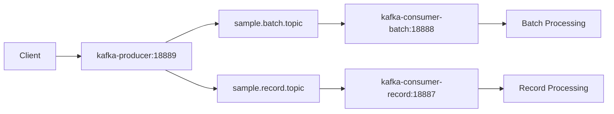

# Kafka Consumer Producer Hello

Spring Boot를 활용한 Kafka Producer/Consumer 데모 프로젝트입니다. 3개의 모듈로 구성되어 있으며, 각각 다른 Kafka 소비 패턴을 구현합니다.
그리고 담당자가 claude code로 생성했습니다.
## 📋 프로젝트 개요

이 프로젝트는 Apache Kafka와 Spring Boot를 사용하여 메시지 생산(Producer)과 소비(Consumer) 패턴을 구현한 데모 애플리케이션입니다.

### 🏗️ 아키텍처

```
kafka-consumer-producer-hello/
├── kafka-producer/           # Kafka 메시지 생산자 (포트: 18889)
├── kafka-consumer-batch/     # Kafka 배치 소비자 (포트: 18888)
├── kafka-consumer-record/    # Kafka 레코드별 소비자 (포트: 18887)
└── pom.xml                  # Parent POM
```

## 🚀 모듈 소개

### 1. kafka-producer
- **포트**: 18889
- **역할**: REST API를 통해 JSON 데이터를 받아 Kafka 토픽으로 전송
- **토픽**: `sample.batch.topic`, `sample.record.topic`
- **기능**: 
  - JSON 유효성 검증
  - 자동 `api_tran_id` UUID 생성
  - Key 기반 메시지 전송 지원

### 2. kafka-consumer-batch
- **포트**: 18888
- **역할**: `sample.batch.topic`에서 배치 방식으로 메시지 소비
- **특징**: 
  - 여러 메시지를 List로 일괄 처리
  - `max.poll.records: 10` 설정으로 최대 10개씩 배치 처리
  - Consumer Group: `sample-consumer`

### 3. kafka-consumer-record
- **포트**: 18887
- **역할**: `sample.record.topic`에서 레코드별로 메시지 소비
- **특징**: 
  - 메시지를 하나씩 개별 처리
  - Consumer Group: `sample-consumer`

## 🛠️ 기술 스택

- **Java**: 21
- **Spring Boot**: 3.5.3
- **Spring Kafka**: Latest
- **Maven**: 3
- **Lombok**: 코드 간소화
- **Jackson**: JSON 처리
- **Logback**: JSON 형태 로깅

## 📝 공통 기능

### JSON 로깅
- **Console**: JSON 형태로 출력
- **File**: `logs/` 디렉토리에 JSON 형태로 저장
  - `kafka-producer-info.log`
  - `kafka-consumer-batch-info.log` 
  - `kafka-consumer-record-info.log`

### Kafka 설정
- **Bootstrap Server**: `localhost:9092`
- **Serializer/Deserializer**: String
  - 줄여서 SerDe

## 🚀 실행 방법

### 사전 요구사항
- Java 21
- Apache Kafka (localhost:9092)
- Maven
- (최소요구 자바) 17

### 애플리케이션 실행

```bash
# 1. Producer 실행
cd kafka-producer && ../mvnw spring-boot:run

# 2. Batch Consumer 실행 (새 터미널)
cd kafka-consumer-batch && ../mvnw spring-boot:run

# 3. Record Consumer 실행 (새 터미널)  
cd kafka-consumer-record && ../mvnw spring-boot:run
```

### 전체 프로젝트 빌드

```bash
# 전체 빌드
./mvnw clean install

# 특정 모듈 빌드
./mvnw clean install -pl kafka-producer
./mvnw clean install -pl kafka-consumer-batch
./mvnw clean install -pl kafka-consumer-record
```

## 📡 API 사용법

### 1. 기본 메시지 전송 (Key 없음)

**엔드포인트**: `POST /putdata`
 - windows 의 경우 git bash 이용하세요.
```bash
curl -X POST http://localhost:18889/putdata \
  -H "Content-Type: application/json" \
  -d '{
    "name": "김철수",
    "age": 30,
    "email": "kimcs@example.com"
  }'
```

**응답**:
```
Data sent successfully with api_tran_id: 550e8400-e29b-41d4-a716-446655440000
```

**전송되는 데이터**:
```json
{
  "name": "김철수",
  "age": 30,
  "email": "kimcs@example.com",
  "api_tran_id": "550e8400-e29b-41d4-a716-446655440000"
}
```

### 2. Key 기반 메시지 전송

**엔드포인트**: `POST /putdata-with-key`
- windows 의 경우 git bash 이용하세요.
```bash
curl -X POST http://localhost:18889/putdata-with-key ^
  -H "Content-Type: application/json" ^
  -d '{ "key": "user123",  "name": "김철수",   "age": 30,  "email": "kimcs@example.com" }'
```
- 특히 sample.batch.topic 한개만 partition을 4개로 하면 key에 따라
partiion 변화를 확인할 수 있음

**응답**:
```
Data sent successfully with key: user123 and api_tran_id: 550e8400-e29b-41d4-a716-446655440000
```

**주의사항**: 
- `key` 필드가 반드시 포함되어야 함
- `key` 필드가 없거나 null인 경우 400 에러 반환

### 3. 복잡한 JSON 구조 예시
- windows 의 경우 git bash 이용하세요.
```bash
curl -X POST http://localhost:18889/putdata \
  -H "Content-Type: application/json" \
  -d '{
    "user": {
      "id": "user123",
      "name": "김철수",
      "department": "개발팀"
    },
    "order": {
      "orderId": "ORD-2025-001",
      "items": [
        {"product": "laptop", "quantity": 1, "price": 1500000},
        {"product": "mouse", "quantity": 2, "price": 25000}
      ],
      "totalAmount": 1550000
    },
    "metadata": {
      "timestamp": "2025-01-01T10:30:00Z",
      "source": "web"
    }
  }'
```

## 🔍 모니터링

### Health Check
```bash
# Producer 상태 확인
curl http://localhost:18889/actuator/health

# Consumer 상태 확인  
curl http://localhost:18888/actuator/health
```

### Prometheus Metrics
```bash
# Producer 메트릭
curl http://localhost:18889/actuator/prometheus

# Consumer-batch 메트릭
curl http://localhost:18888/actuator/prometheus

# Consumer-record 메트릭
curl http://localhost:18887/actuator/prometheus
```

## 📊 메시지 흐름



## 🚨 에러 처리

### 잘못된 JSON 형식
```bash
curl -X POST http://localhost:18889/putdata \
  -H "Content-Type: application/json" \
  -d '{name: "test"}'  # 따옴표 누락

# 응답: "Invalid JSON format: ..."
```

### Key 누락 (putdata-with-key)
```bash
curl -X POST http://localhost:18889/putdata-with-key \
  -H "Content-Type: application/json" \
  -d '{"name": "test"}'  # key 필드 누락

# 응답: "Missing required 'key' field in JSON data"
```

## 📁 로그 파일 위치

```
logs/
├── kafka-producer-info.log
├── kafka-consumer-batch-info.log
└── kafka-consumer-record-info.log
```

모든 로그는 JSON 형식으로 기록되며, 일별로 롤링됩니다.

## 🔧 설정 정보

### application.yml 주요 설정

```yaml
spring:
  kafka:
    bootstrap-servers: localhost:9092
    consumer:
      group-id: sample-consumer
    producer:
      key-serializer: org.apache.kafka.common.serialization.StringSerializer
      value-serializer: org.apache.kafka.common.serialization.StringSerializer
```

## 🐛 트러블슈팅

### JAVA_HOME 설정 필요
```bash
export JAVA_HOME="/path/to/java-21"
```

### Kafka 연결 실패
- Kafka 서버가 localhost:9092에서 실행 중인지 확인
- 방화벽 설정 확인

### 포트 충돌
- kafka-producer: 18889 포트 사용
- kafka-consumer-batch : 18888 포트 사용
- kafka-consumer-record: 18887 포트 사용

## 📈 확장 가능성

- 추가 토픽 지원
- 다양한 Serializer/Deserializer 지원
- 메시지 필터링 기능
- Dead Letter Queue 구현
- 메시지 재처리 로직

---

**개발자**: Spring Boot + Kafka 데모 프로젝트  
**버전**: 0.0.1-SNAPSHOT